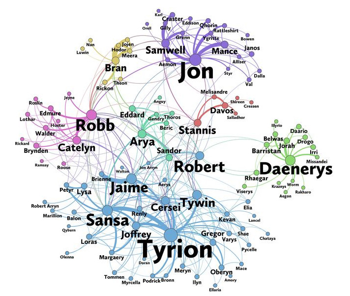

# Network-Analysis-of-Game-of-Thrones
Context
----
In this notebook, we will analyze the co-occurrence network of the characters in the  Game of Thrones books. Here, two characters are considered to co-occur if their names appear in the vicinity of 15 words from one another in the books. Based on Network Analysis measures, we will calculate the importance of each node in order to identify their importance in the co-occurrence network.

Network Analysis Measures:
----
* Degree centrality
* Betweenness centrality
* PageRank

DataSet
----

This dataset constitutes a network and is given as a text file describing the <em>edges</em> between characters, with some attributes attached to each edge. 

